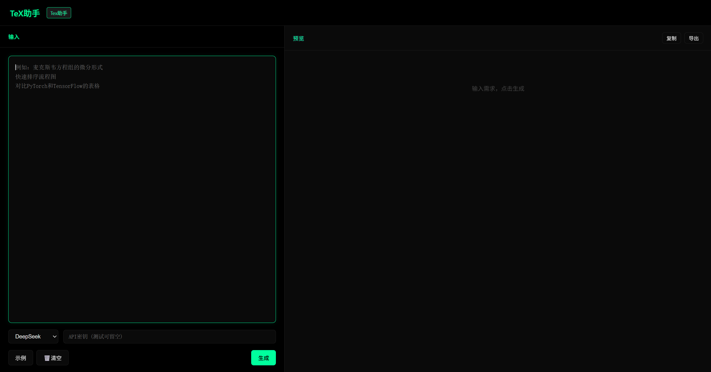

# Tex-assistant
解决使用ai输出文本的时候常遇见的格式不易阅读、不方便插入现有文件等问题。

## 功能特点

- **LaTeX公式**：一键生成复杂数学公式，实时渲染
- **流程图绘制**：用文字描述，自动生成Mermaid流程图
- **表格生成**：智能生成规范Markdown表格
- **自备API**：用户输入自己的API密钥，安全可控

## 界面预览

## 在线体验

(https://你的用户名.github.io/SparkTeX/)
*需自备DeepSeek或OpenAI API密钥*

## 技术栈

- 纯HTML/CSS/JavaScript，无需后端
- Marked.js - Markdown解析
- KaTeX - 公式渲染
- Mermaid.js - 流程图渲染
- Highlight.js - 代码高亮
- DeepSeek API - AI生成能力

## 本地运行

1. 克隆本项目
2. 用浏览器打开 `index.html`
3. 输入你的API密钥开始使用

## 使用提示

- DeepSeek API目前免费，可在 [platform.deepseek.com](https://platform.deepseek.com/) 申请
- 所有API请求在浏览器端完成，不会上传到任何服务器
- 支持DeepSeek和OpenAI两种模型

## 作者

## 许可证

MIT
